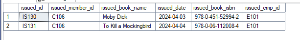
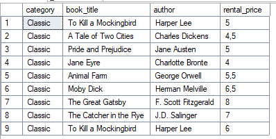

# 📊 Project Library Management

---

## 📝 Project Objective


The objective of this project is to **practice SQL** by working with the Library Management dataset. The goal is to **clean the data, perform CRUD operations, explore the dataset**, and **extract actionable business insights**.

---

## 🧭 Project Workflow

1. **Database Setup:** Create and populate the SQL database.
2. **CRUD Operations:** Apply Create, Read, Update, Delete operations to manage data.
3. **Data Cleaning:** Ensure data consistency and remove invalid entries.
4. **Exploratory Data Analysis (EDA):** Generate questions and explore the dataset.
5. **Insights Delivery:** Extract and present key business insights.

---

## 📂 Project Files

- **Tool Used:** SQL Server Management Studio (SSMS)
- **SQL Script:** `Analysis Queries.sql` 
- **Dataset Link:** Query SQL Server.
- **Format**: `Query`
- **Schema**:


---

## 🛠️ Database Preparation & Cleaning

### ✅ Setting up the Database

For this project, we need to first create the scheme of the DataSet, before inserting the information that we are going to use. 

```sql

-- Library Management System

-- Creating tables for the project
drop table if exists branch
create table branch (
	branch_id varchar (10) primary key, -- PK
	manager_id varchar (10), -- FK
	branch_address varchar (55),
	contact_no varchar (15)
)

drop table if exists employees
create table employees(
	emp_id varchar(10) primary key, -- PK
	emp_name varchar(25),
	position varchar(15),
	salary int,
	branch_id varchar(10) -- FK
)

drop table if exists books
create table books (
	isbn varchar(20) primary key, -- PK
	book_title varchar (75),
	category varchar (25),
	rental_price float,
	status varchar (10),
	author varchar (35),
	publisher varchar (55)
)


drop table if exists members
create table members(
	member_id varchar (10) primary key, -- PK
	member_name varchar (25),
	member_address varchar (75),
	reg_date date
)

drop table if exists issued_status
create table issued_status(
	issued_id varchar (10) primary key, -- PK
	issued_member_id varchar (10), -- FK
	issued_book_name varchar (75),
	issued_date date,
	issued_book_isbn varchar (20), -- FK
	issued_emp_id varchar (10) -- FK
)

drop table if exists return_status
create table return_status(
	return_id varchar (10) primary key, -- PK
	issued_id varchar (10), -- FK
	return_book_name varchar (75),
	return_date date,
	return_book_isbn varchar (20) -- FK
)
-- We can put the FK in the initial table, but we want to show the way you can add FK after the creation of Tables.
-- Adding FK to the Table ISSUED STATUS
alter table issued_status -- Table to modify
add constraint fk_members
foreign key (issued_member_id) -- FK to stablish
references members(member_id) -- PK to use

alter table issued_status
add constraint fk_books
foreign key (issued_book_isbn)
references books(isbn)

alter table issued_status
add constraint fk_employees
foreign key (issued_emp_id)
references employees(emp_id)

-- Adding FK to the Table Return Status

alter table employees
add constraint fk_branch
foreign key (branch_id)
references branch(branch_id)

alter table return_status
add constraint fk_issued_status
foreign key (issued_id)
references issued_status(issued_id)
```

Once the Scheme is created, the analyzer tool from Microsoft SQL Server will determine the connection between the PK and FK. 

📝 We use the following Queries to populate the DB.

- insert_queries.sql
- insert_queries_2.sql

## 🧭 CRUD Operations.

CRUD: Apply Create, Read, Update, Delete operations to manage data.

1. Task: Create a New Book Record -- "978-1-60129-456-2', 'To Kill a Mockingbird', 'Classic', 6.00, 'yes', 'Harper Lee', 'J.B. Lippincott & Co.')"
   
```sql
-- CRUD Operations
---- Create:This operation adds new data records to a database or data store. For example, in a database table, a new row is added. 
---- Read:This operation retrieves or reads existing data from a database or data store. This is often done through queries or searches. 
---- Update:This operation modifies existing data records in a database or data store. For example, changing a user's email address in a database. 
---- Delete:This operation removes data records from a database or data store. For example, deleting a user record from a database. 

Insert into books (isbn, book_title, category, rental_price, status, author, publisher)
values ('978-1-60129-456-2', 'To Kill a Mockingbird', 'Classic', 6.00, 'yes', 'Harper Lee', 'J.B. Lippincott & Co.')
select * from books -- Value added succesfully.
```

2. Task: Update an Existing Member's Address Member_id = C103 - New Address '125 Oak st'\

```sql
select *
from members
where member_id = 'C103'
-- Current address 789 Oak ST

update members
set member_address = '125 Oak st'
where member_id = 'C103'

select *
from members
where member_id = 'C103'

```

3. Task: Delete a Record from the Issued Status Table -- Objective: Delete the record with issued_id = 'IS121' from the issued_status table.

```sql 
select *
from issued_status
where issued_id = 'IS121'

-- Issued Book Name The Shining

delete from issued_status
where issued_id = 'IS121'

select *
from issued_status
where issued_id = 'IS121'

-- Id deleted
```

## 🔍 Exploratory Data Analysis (EDA)

The goal of this stage is to explore trends and patterns in the dataset that can lead to actionable insights.

1. Task: Retrieve All Books Issued by a Specific Employee -- Objective: Select all books issued by the employee with emp_id = 'E101'.
```sql
select *
from issued_status
where issued_emp_id = 'E101'
```


2. Task: List Members Who Have Issued More Than One Book -- Objective: Use GROUP BY to find members who have issued more than one book.

```sql
select issued_emp_id, count(*) as NumberOfBooksIssued
from issued_status
group by issued_emp_id
having COUNT(*) > 1
```


3. Task: Create Summary Tables: Used CTAS to generate new tables based on query results - each book and total book_issued_cnt**
   
``` sql
with book_issue_summary as (
select
	b.isbn, 
	b.book_title, 
	COUNT(ist.issued_id) as  issued_count
from issued_status as ist
left join books as b
on ist.issued_book_isbn = b.isbn
group by b.isbn, b.book_title)

select top 10 *
from book_issue_summary
order by issued_count desc
```


4. Task: Retrieve All Books in a Specific Category.


```sql
select category, book_title,author, rental_price
from books
where category = 'Classic'
```



5. Task: Find Total Rental Income by Category.
   
```sql
select b.category, count(*) as BooksIssued, sum(b.rental_price) as TotalAmount
from issued_status as ist 
left join books as b
on b.isbn = ist.issued_book_isbn
group by b.category
order by BooksIssued desc
```


6. Task: List Employees with their branch Manager's name and their branch detail.

```sql
select 
	e.emp_id,
	e.emp_name,
	e.position,
	e.salary,
	b.*,
	e1.emp_name as manager
from employees as e
left join branch as b
	on e.branch_id = b.branch_id
join 
employees as e1
	on e1.emp_id = b.manager_id
```


7. Task: Create a table of books with rental price above certain Threshold.
```sql
with Expensive_books as (
select *
from books
where rental_price > 5)

select *
from Expensive_books
```


8. Task: Retrive the list of books not yet returned.
```sql
select *
from issued_status as i
left join return_status as r
on r.return_id = i.issued_id
where r.return_id is null
```


9. Task: Identify Members with Overdue Books. Write a query to identify members who have overdue books (assume a 30-day return period).  Display the member's_id, member's name, book title, issue date, and days overdue.

```sql
Review with what are we working on and what tables do we need to use for this request.

select * from issued_status
select * from members
select * from books

-- We need: Member id, member name, Issued Book Name, issued date.

select 
	m.member_id, 
	m.member_name,
	b.book_title,
	iss.issued_date,
	rs.return_date,
	DATEdiff(DAY, iss.issued_date, GETDATE()) as over_due_days
from issued_status as iss
join members as m
	on m.member_id = iss.issued_member_id
join books as b
	on b.isbn = issued_book_isbn
left join return_status as rs
	on rs.issued_id = iss.issued_id
-- The tables that we need to solve the issue. 
where 
	return_date is null
	and DATEdiff(DAY, iss.issued_date, GETDATE()) > 30
	-- How to get all the books that the due date is longer than 30 days.
order by 1
```


10. Task: Branch Performance Report. Create a query that generates a performance report for each branch showing the number of books issued. The number of books returned and the total revenue generated from book rentals.
```sql
--Review what tables do we need to solve this question.
select * from branch -- The Branchs that exists
select * from issued_status -- The status of each request
select * from employees -- The employees for each branch
select * from books -- The Books that exists
select * from return_status -- All the returns done

-- We need to conect the information


SELECT 
	br.branch_id, 
	br.manager_id, 
	count(iss.issued_book_isbn) as Total_Books_Rented,
	count(rs.return_id) as Total_Returned, 
	sum(b.rental_price) as Total_revenue
into branch_report
	from 
		issued_status as iss
	join employees as e
		on e.emp_id = iss.issued_emp_id
	join branch as br
		on e.branch_id = br.branch_id
	left join return_status as rs -- We conect with a left join because there still books missing, we dont want to have nulls.
		on rs.issued_id = iss.issued_id
	join books as b
		on iss.issued_book_isbn = b.isbn
	group by br.branch_id, br.manager_id

select * from branch_report
order by Total_revenue desc
```


11. Task: Create a table with CTAS. Use the CTAS to create a new table Active Members containing members who have issued at least one book in the last 16 months.
```sql
with Active_members as(
select 	*
from members as m
join issued_status as iss
	on m.member_id = iss.issued_member_id
where iss.issued_date between dateadd(month, -16,getdate()) and getdate()
)
select * from Active_members
```


18. Task: Find Employees with the most books processed.Write a Query to fin the top 3 employees who have processed the most books issues. Display the information in the following format: Name. Number of books. Branch.
```sql
select * from employees
select * from issued_status

select 
	top 3 -- Returns only the top 3
	e.emp_name, 
	e.branch_id, 
	count(iss.issued_id) as Number_of_books
from employees as e
join issued_status as iss
on e.emp_id = iss.issued_emp_id
group by e.emp_name, e.branch_id
order by 3 desc -- So we can have the highest issuer employee.
```


## 🎯 Key Findings

- 💡 **[Insight 1]**: 
- 📈 **[Insight 2]**: 
- 🧩 **[Insight 3]**: 
---

## 🧠 Learnings & Challenges

**Learned:**
- How to handle the use CASE to classify information.
- Improved the use of CTEs to prevent long queries.

**Challenges:**
- Using the function cast to prevent ordering information incorrectly.
- Dealing with different formats to evaluate searches.

